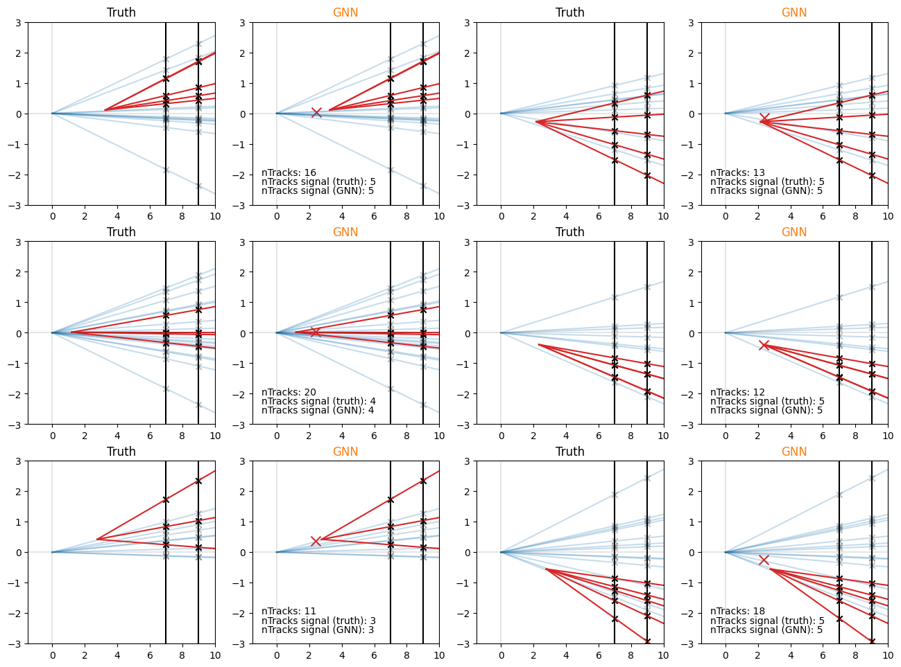

# Graph Neural Net Example

A simple example of node classification using a simple toy model of a displaced vertex.

The network performs two tasks: classifying tracks into signal (red), and background (blue), and predicts the position of the signal vertex.

## Setting up

* ssh to DICE
```
ssh USER@gc00.dice.priv
```
* Wiki instructions to get conda and python on gc00.
* Graphcore instructions to get tensorflow
* Install the spektral libary
```
pip install --upgrade pip
pip install spektral
```
* create source file, consider adding to bashrc

```
python GNN.py
```

## Example output


